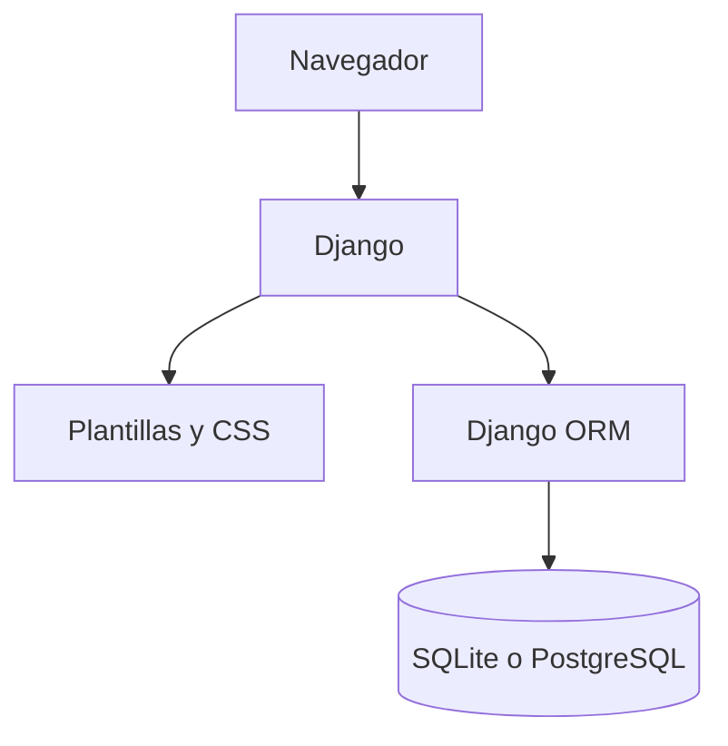

# Descripción y justificación técnica de CleanIt

## 1. Estado técnico

CleanIt ya no es solo una propuesta documental. El incremento 2.2 contiene una aplicación Django ejecutable con autenticación, roles, panel diferenciado, administración de cuentas, zonas y tareas. Se encuentra en `dev` hasta completar su validación en Windows.

## 2. Tecnologías utilizadas

| Área | Tecnología versionada | Uso real en el incremento 2.2 |
|---|---|---|
| Lenguaje | Python 3.12 | Configuración, modelos, vistas y pruebas |
| Framework web | Django 5.2.17 LTS | Autenticación, autorización, ORM, migraciones, plantillas, administración y pruebas |
| Interfaz | Plantillas Django, HTML5 y CSS3 | Acceso, panel, formularios y tablas adaptables |
| Base de datos local | SQLite | Ejecución y pruebas rápidas sin servicios externos |
| Base de datos integrada | PostgreSQL 16 | Servicio persistente definido en Docker Compose |
| Servidor de aplicación | Gunicorn 23.0.0 | Ejecución WSGI dentro del contenedor web |
| Contenedores | Docker y Docker Compose | Reproducción de Django y PostgreSQL |
| Versionamiento | Git y GitHub | Flujo `dev` → `qa` → `pre-main` → `main` |

Bootstrap continúa como alternativa del stack aprobado, pero no se incorporó todavía. La interfaz actual utiliza una hoja CSS propia y no depende de recursos externos para mostrar el acceso, los formularios ni los listados. Si se adopta Bootstrap más adelante, el cambio deberá simplificar estilos existentes y quedar registrado.

## 3. Justificación de las decisiones

### Python y Django

El producto es principalmente transaccional y CRUD: usuarios, tareas, responsables, frecuencias e historial. Django reúne en un solo framework la autenticación, el hash de contraseñas, los permisos, las validaciones, las migraciones, el ORM, las plantillas y las pruebas. Esto reduce la cantidad de tecnologías que debe mantener el equipo.

Se eligió Django **5.2.17 LTS** para priorizar estabilidad y soporte extendido durante el desarrollo académico.

### Plantillas renderizadas en el servidor

CleanIt no necesita inicialmente un frontend independiente. Django genera el HTML y valida en el servidor quién puede consultar cada función. Esta arquitectura evita mantener dos proyectos, dos cadenas de compilación y una API pública antes de que sean necesarias.

### PostgreSQL y SQLite

PostgreSQL será la base integrada porque permite relaciones, restricciones y transacciones para proteger la coherencia entre usuarios, tareas y cumplimientos. SQLite se conserva como alternativa local predeterminada para iniciar el proyecto y ejecutar pruebas sin instalar un servidor de base de datos.

La selección se realiza automáticamente: si existe `DATABASE_HOST`, Django usa PostgreSQL; de lo contrario usa SQLite.

### Docker Compose

El archivo `compose.yaml` describe los servicios `web` y `db`, comprueba la disponibilidad de PostgreSQL antes de iniciar Django y conserva los datos en un volumen. De esta forma el equipo puede repetir el mismo ambiente sin instalar PostgreSQL directamente.

## 4. Arquitectura implementada



Es un monolito modular. En este incremento existen:

- `accounts`: usuario personalizado, roles, administración y rutas de sesión;
- `chores`: zonas, tareas, responsables, frecuencias, formularios y permisos de administración;
- `core`: panel principal y presentación según permisos;
- `config`: configuración, rutas globales y entrada WSGI/ASGI;
- `templates`: vistas HTML compartidas;
- `static`: estilos de la interfaz.

## 5. Seguridad implementada

- Todas las páginas funcionales requieren sesión.
- Django gestiona el hash de las contraseñas.
- Las cuentas inactivas no pueden autenticarse.
- El panel cambia según el rol evaluado en el servidor.
- Las rutas de zonas y tareas vuelven a comprobar el rol en el servidor.
- Un participante recibe un error 403 aunque escriba directamente una URL administrativa.
- Zonas y responsables inactivos no pueden utilizarse en tareas nuevas.
- El cierre de sesión exige `POST` y token CSRF.
- Se habilitaron protección CSRF, `X-Frame-Options: DENY` y `nosniff`.
- Las cookies de sesión y CSRF están marcadas como `HttpOnly`.
- Los secretos y bases locales están excluidos de Git; fuera de `DEBUG`, la clave secreta es obligatoria.

Antes de producción aún será obligatorio desactivar `DEBUG`, definir una clave secreta real, configurar HTTPS y ejecutar `check --deploy`.

## 6. Persistencia y migraciones

El modelo `accounts.User` amplía `AbstractUser` e incorpora:

- correo electrónico único;
- rol `ADMIN` o `PARTICIPANT`;
- estado activo heredado de Django;
- reconocimiento de superusuarios como administradores funcionales.

La migración `accounts/0001_initial.py` crea el esquema de usuarios. La migración `chores/0001_initial.py` incorpora:

- `Zone`: nombre único, descripción, estado y fechas de control;
- `Chore`: nombre, descripción, zona, responsable, frecuencia, próxima fecha, estado y autor del registro.

Las relaciones con zona y responsable utilizan `PROTECT` para impedir eliminaciones que rompan la integridad. La interfaz aplica retiro o desactivación lógica mediante `is_active`.

## 7. Pruebas automatizadas actuales

La suite del incremento 2.2 contiene dieciocho verificaciones. Las ocho primeras cubren cuentas y panel:

| Grupo | Verificación |
|---|---|
| Modelo | Un usuario nuevo recibe el rol Participante |
| Modelo | El rol Administrador se reconoce correctamente |
| Modelo | Un superusuario recibe automáticamente el rol Administrador |
| Autenticación | Una cuenta inactiva no puede ingresar |
| Acceso | El panel redirige a quien no tiene sesión |
| Autorización | El participante no ve la administración |
| Autorización | El administrador sí ve su opción de gestión |
| Presentación | El superusuario se identifica visualmente como Administrador |

Las diez verificaciones restantes cubren la gestión:

| Grupo | Verificación |
|---|---|
| Modelo | Una tarea rechaza zonas inactivas |
| Formulario | Una tarea rechaza responsables inactivos |
| Acceso | Un visitante es enviado al inicio de sesión |
| Autorización | Un participante no abre la gestión de tareas |
| Autorización | Un participante no crea zonas mediante una solicitud directa |
| Interfaz | Los cuatro listados y formularios administrativos se renderizan |
| CRUD | El administrador crea una zona |
| CRUD | El administrador crea una tarea con autor y responsable |
| Retiro lógico | Una tarea solo se retira mediante `POST` |
| Integridad | Una zona con tareas activas no puede desactivarse |

Comandos de control:

```bash
python manage.py test
python manage.py check
python manage.py makemigrations --check --dry-run
```

La validación del incremento 2.1 en Windows produjo **8 pruebas aprobadas, 0 fallidas**. El incremento 2.2 produjo en desarrollo **18 pruebas aprobadas, 0 fallidas**, sin problemas de sistema ni migraciones sin registrar. La evidencia formal se repetirá al promover el cambio a `qa`.

## 8. Limitaciones actuales

- Todavía no existe el registro de cumplimientos ni el cálculo automático de recurrencias.
- El participante aún no consulta sus tareas desde las tarjetas del panel.
- No se ha ejecutado la validación formal en `qa`.
- Docker no pudo ejecutarse dentro del ambiente de edición actual; su configuración debe comprobarse en un equipo con Docker Desktop o Docker Engine.
- No existe un despliegue público.
- Las tarjetas funcionales del panel son informativas hasta los siguientes incrementos.
