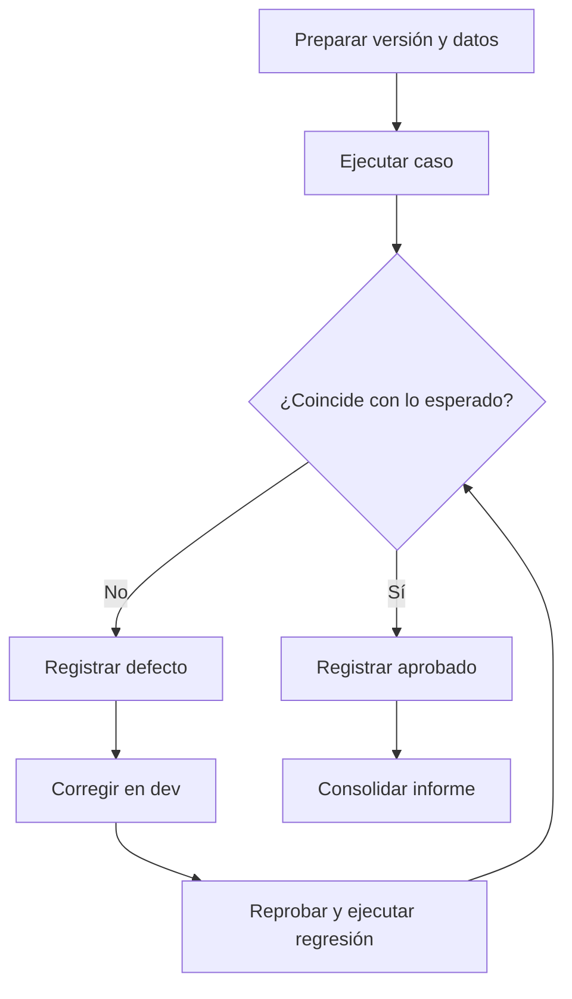

# Plan de pruebas del sistema CleanIt

## 1. Control del documento

| Campo | Valor |
|---|---|
| Proyecto | CleanIt - Organizador de tareas de limpieza |
| Versión del plan | 1.1 |
| Estado | Diseñado, pendiente de ejecución real |
| Fase del producto | Planificación |
| Responsable de verificación | Rol Calidad y DevOps |
| Autor | Sergio Andres Marin Martinez |
| Fecha de referencia | 7 de septiembre de 2026 |

### Historia de revisiones

| Fecha | Versión | Descripción | Autor |
|---|---:|---|---|
| 07/09/2026 | 1.0 | Primera propuesta del plan | Sergio Andres Marin Martinez |
| 07/09/2026 | 1.1 | Adaptación a la plantilla académica, métricas y flujo de cuatro ramas | Sergio Andres Marin Martinez |

> [!CAUTION]
> Este documento define cómo se probará el sistema cuando exista una versión ejecutable. Las evidencias actuales son simuladas y no autorizan una liberación real.

## 2. Propósito

Definir el enfoque de verificación y validación con el que se comprobará que CleanIt satisface sus requisitos funcionales y no funcionales, mantiene la integridad de tareas e historial y ofrece una experiencia comprensible para administradores y participantes.

## 3. Objetivos

- Asociar cada historia SCRUM-15 a SCRUM-23 con casos verificables.
- Cubrir flujos positivos, validaciones, excepciones y riesgos prioritarios.
- Verificar las frecuencias única, diaria, semanal y mensual, incluyendo límites de calendario.
- Confirmar que los permisos se apliquen tanto en la interfaz como en el servidor.
- Evitar pérdida, duplicidad o exposición indebida de información.
- Establecer métricas y criterios objetivos para promover versiones entre ramas.
- Conservar evidencia reproducible de ejecución, defecto, corrección, reprueba y regresión.

## 4. Alcance

### 4.1 Incluido

- inicio y cierre de sesión;
- registro, edición y desactivación de personas;
- creación, consulta, edición y retiro lógico de tareas;
- asociación de zonas, responsables, fechas y frecuencias;
- consulta de pendientes y vencimientos por usuario;
- registro de cumplimiento y cálculo de la siguiente ocurrencia;
- consulta y filtrado del historial;
- permisos de administrador y participante;
- validación de entradas, CSRF y manejo de datos sensibles;
- interfaz adaptable y usabilidad de los recorridos principales;
- rendimiento y estrés para el contexto de grupos pequeños;
- respaldo y restauración de PostgreSQL;
- completitud y entendibilidad de los documentos del proyecto.

### 4.2 Excluido de la primera versión

- pagos, contratación e inventario de insumos;
- múltiples sedes aisladas en una sola instancia;
- sensores y dispositivos inteligentes;
- aplicación móvil nativa;
- notificaciones por correo, SMS o mensajería;
- alta disponibilidad e integraciones externas no definidas.

## 5. Base de prueba

- Objetivo y alcance aprobados en la actividad anterior.
- Historias de usuario SCRUM-15 a SCRUM-23 y sus criterios de aceptación.
- Tareas técnicas SCRUM-33 a SCRUM-36.
- Riesgos: baja adopción, frecuencia incorrecta, acceso no autorizado, pérdida de información y falta de actualización.
- Arquitectura propuesta con Python, Django, Bootstrap, PostgreSQL y Docker Compose.
- Modelo de calidad, métricas y métodos presentados en la Unidad 3.

La relación detallada se encuentra en la [matriz de trazabilidad](05_Matriz_de_trazabilidad.md).

## 6. Elementos objeto de prueba

| Elemento previsto | Responsabilidad principal | Niveles aplicables |
|---|---|---|
| Módulo de cuentas | Autenticación, roles y estado del usuario | Unitaria, integración, sistema, seguridad |
| Módulo de tareas | Datos, zonas, frecuencia, responsable y retiro lógico | Unitaria, integración, sistema |
| Módulo de seguimiento | Pendientes, vencimientos, finalización e historial | Unitaria, integración, sistema, rendimiento |
| Persistencia | Integridad relacional, transacciones y recuperación | Integración, concurrencia, respaldo |
| Interfaz | Formularios, mensajes, navegación y adaptación | Sistema, compatibilidad, usabilidad |
| Documentación | Plan, casos, manual y descripción técnica | Prueba documental |

## 7. Ambiente previsto

| Componente | Configuración propuesta |
|---|---|
| Aplicación | Python y Django con configuración separada para pruebas |
| Interfaz | Plantillas Django, HTML, CSS y Bootstrap |
| Base de datos | PostgreSQL exclusiva para QA |
| Contenedores | Docker Compose con servicios `web` y `db` |
| Navegadores | Versiones estables de Chrome, Firefox y Edge |
| Vista móvil | 360 px, 390 px y 430 px; emulación y dispositivo real cuando sea posible |
| Datos | Identidades y tareas ficticias, sin información personal real |
| Trazabilidad | Jira, commits, pull requests e incidencias de GitHub |

No se utilizará la base productiva para pruebas destructivas, carga o restauración.

## 8. Datos de prueba

| Identificador | Estado y rol | Uso principal |
|---|---|---|
| `admin.cleanit` | Administrador activo | Personas, tareas, asignaciones e historial |
| `ana.prueba` | Participante activo | Pendientes y finalización propia |
| `luis.prueba` | Participante activo | Aislamiento entre usuarios |
| `maria.inactiva` | Participante inactivo | Rechazo de acceso y asignación |

Tareas de referencia: `Barrer sala` (única), `Sacar basura` (diaria), `Limpiar baño` (semanal), `Lavar ventanas` (mensual con día ancla 31) y `Trapear cocina` (vencida).

## 9. Roles y responsabilidades

| Rol | Responsabilidad en pruebas |
|---|---|
| Product Owner | Aclarar criterios, revisar resultados y decidir la aceptación |
| Scrum Master | Facilitar seguimiento de bloqueos y acciones |
| Desarrollo | Implementar pruebas unitarias, corregir defectos y aportar evidencia técnica |
| Calidad y DevOps | Mantener el plan, preparar ambientes, ejecutar casos y consolidar resultados |
| Usuario representativo | Participar en usabilidad y aceptación |

Una persona puede asumir varios roles en un equipo pequeño. Siempre que sea posible, un cambio sensible de seguridad o persistencia será revisado por alguien distinto de su autor.

## 10. Criterios de entrada

Una versión puede ingresar a `qa` cuando:

- el alcance y el commit estén identificados;
- las historias incluidas tengan criterios de aceptación;
- las migraciones se apliquen sin errores;
- exista un ambiente aislado con datos controlados;
- las pruebas unitarias disponibles hayan aprobado;
- no exista un defecto crítico conocido que impida iniciar;
- los casos aplicables estén asociados al cambio.

## 11. Suspensión y reanudación

La ejecución se suspenderá si:

- el ambiente no permite resultados reproducibles;
- falla una migración o se pierde la conexión persistente;
- aparece un defecto crítico que bloquea los demás recorridos;
- los datos de prueba se contaminan o incluyen información real;
- no puede identificarse la versión probada.

Se reanudará después de documentar la causa, restaurar el ambiente, verificar una prueba de humo y registrar la nueva versión o configuración.

## 12. Criterios de salida

Una versión podrá avanzar de `qa` a `pre-main` cuando:

- se haya ejecutado el 100 % de los casos críticos y altos aplicables;
- cada historia incluida tenga cobertura;
- al menos el 95 % de los casos aplicables esté aprobado;
- no permanezcan defectos críticos ni altos abiertos;
- todo defecto medio aceptado tenga responsable y tratamiento;
- las evidencias indiquen versión, ambiente, fecha y ejecutor.

Podrá avanzar de `pre-main` a `main` cuando, además:

- la regresión crítica esté aprobada;
- seguridad, rendimiento y restauración cumplan sus objetivos;
- el Product Owner registre aceptación;
- la documentación corresponda a la versión candidata.

## 13. Clasificación de defectos

| Severidad | Criterio | Ejemplo en CleanIt | Efecto en la promoción |
|---|---|---|---|
| Crítica | Compromete datos sensibles, destruye información o impide usar el sistema | Acceso administrativo sin autenticación | Suspende pruebas y bloquea toda promoción |
| Alta | Bloquea una función esencial o rompe el aislamiento | Participante consulta tareas ajenas | Bloquea `pre-main` y `main` |
| Media | Afecta una función con alternativa temporal | Recurrencia mensual falla en un límite | Requiere tratamiento antes de `main` |
| Baja | Defecto visual o mejora que no bloquea el recorrido | Desalineación en una resolución poco común | Puede aceptarse con decisión documentada |

Cada defecto debe contener pasos de reproducción, esperado, observado, ambiente, commit, evidencia, severidad y caso relacionado.

## 14. Ciclo de ejecución

## 15. Entregables del Paso 1

- fundamentos y vocabulario;
- plan de pruebas;
- estrategia por niveles y ramas;
- modelo con 30 casos detallados;
- matriz de trazabilidad;
- catálogo de métricas y metas;
- plantillas de caso y registro de ejecución;
- dos ciclos de evidencia simulada claramente rotulados;
- modelo formal en Word basado en la plantilla académica.

## 16. Riesgos del proceso

| Riesgo | Impacto | Tratamiento |
|---|---|---|
| No existe software ejecutable | No puede generarse evidencia real | Mantener resultados como simulados y ejecutar al existir el MVP |
| Criterios ambiguos | Interpretaciones diferentes | Validar previamente con Product Owner |
| Pocos datos de límite | Defectos no detectados | Mantener catálogo de fechas, roles y estados |
| Ambiente distinto de producción | Resultados poco representativos | Reproducir versiones mediante contenedores |
| Poco tiempo para regresión | Efectos secundarios | Automatizar primero casos críticos |
| Evidencia con información personal | Exposición de datos | Utilizar identidades ficticias y revisar capturas |

## 17. Aprobación

La versión 1.1 del plan queda disponible para revisión académica. Su aprobación confirma el enfoque documental; no afirma que el sistema ni sus pruebas hayan sido ejecutados.

