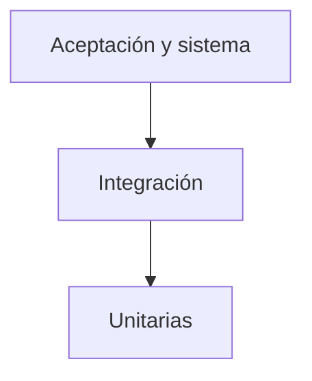

# Estrategia de pruebas

## 1. Enfoque general

CleanIt aplicará pruebas tempranas, trazables y basadas en riesgos. La estrategia combina verificación estática de requisitos y documentos con pruebas dinámicas futuras sobre el código y el sistema ejecutable.

La base tendrá más pruebas unitarias automatizadas; la parte superior concentrará menos recorridos completos, más costosos pero cercanos al uso real.

## 2. Puertas de calidad por rama

| Origen y destino | Validaciones mínimas | Evidencia futura |
|---|---|---|
| Rama corta -> `dev` | Revisión, análisis estático y unitarias relacionadas | Pull request y salida automatizada |
| `dev` -> `qa` | Compilación/configuración correcta, migraciones y prueba de humo | Commit candidato y ambiente identificado |
| `qa` -> `pre-main` | Integración, sistema y casos altos; aprobación >= 95 %; sin defectos altos/críticos | Informe de QA, incidencias y repruebas |
| `pre-main` -> `main` | Regresión, seguridad, rendimiento, recuperación y aceptación | Acta de aceptación y etiqueta de versión |

La promoción siempre será hacia la siguiente rama. Un resultado fallido regresa como corrección a `dev` y vuelve a recorrer las puertas aplicables.

## 3. Niveles de prueba

| Nivel | Objetivo | Técnica y herramientas previstas | Casos |
|---|---|---|---|
| Unitaria | Verificar reglas aisladas | Django TestCase, particiones, límites y transiciones | PU-01 a PU-05 |
| Integración | Verificar colaboración entre capas | Cliente de Django, ORM y PostgreSQL de QA | PI-01 a PI-06 |
| Sistema funcional | Validar recorridos completos por rol | Ejecución manual guiada y automatización futura | PSF-01 a PSF-11 |
| Sistema no funcional | Evaluar atributos de calidad | Navegadores, accesibilidad, carga, estrés, seguridad y restauración | PSN-01 a PSN-06 |
| Documental | Revisar artefactos del proyecto | Lista de comprobación de formato, completitud, correctitud y entendibilidad | PD-01 y PD-02 |

## 4. Técnicas de diseño

- **Particiones de equivalencia:** nombres, correos, roles, estados y frecuencias válidos e inválidos.
- **Valores límite:** campos vacíos, longitudes máximas, fechas de fin de mes, cambio de año y pantalla de 360 px.
- **Tablas de decisión:** combinación de rol, estado de la persona y operación solicitada.
- **Transición de estados:** tarea pendiente, vencida, completada o retirada; persona activa o inactiva.
- **Pruebas basadas en riesgos:** prioridad para permisos, recurrencia, concurrencia, historial y recuperación.
- **Recorridos de usuario:** tareas frecuentes completas con una cantidad razonable de pasos.
- **Pruebas negativas:** solicitudes manipuladas, credenciales inválidas, responsables inactivos y datos fuera del catálogo.

## 5. Procedimiento de integración

Adaptando la plantilla académica, cada integración seguirá este proceso:

1. Identificar componentes, versiones, commit e implementadores.
2. Preparar una base aislada y aplicar migraciones.
3. Ejecutar pruebas unitarias de los componentes involucrados.
4. Ejecutar los casos de integración definidos para el cambio.
5. Clasificar los defectos encontrados.
6. Si existe un defecto crítico o alto que comprometa la integración, detener la promoción y corregir en `dev`.
7. Si no existen bloqueos, completar la prueba de humo y registrar la integración como candidata para pruebas del sistema.

## 6. Estrategia funcional

Cada historia tendrá al menos:

- un escenario positivo;
- un escenario de validación o excepción;
- una comprobación de persistencia o trazabilidad cuando modifique datos;
- una comprobación de autorización cuando la operación dependa del rol.

Los casos del sistema utilizarán datos ficticios estables para que los resultados sean repetibles.

## 7. Estrategia no funcional

### Seguridad

Se probarán autenticación, cierre de sesión, permisos por rol, acceso directo por URL, protección CSRF, validación del lado del servidor y ausencia de secretos en el repositorio. Las contraseñas y tokens nunca formarán parte de capturas o registros.

### Usabilidad y compatibilidad

Cinco usuarios representativos completarán cuatro recorridos: iniciar sesión, localizar un pendiente, completarlo y consultar el historial. La meta es al menos 85 % de recorridos sin ayuda y un promedio no superior a tres minutos. Se comprobarán Chrome, Firefox y Edge, además de anchos de 360, 390 y 430 px.

### Rendimiento

Se propone una carga objetivo de 50 usuarios virtuales durante 10 minutos, con 1.000 tareas y 5.000 registros históricos. El tiempo p95 de las operaciones principales deberá ser igual o inferior a 2 segundos y la tasa de error inferior a 1 %.

### Estrés

La carga crecerá gradualmente por encima del objetivo hasta detectar degradación. La prueba no busca prometer una capacidad predeterminada, sino identificar el límite, comprobar respuestas controladas y confirmar que no exista corrupción de datos después de recuperar el servicio.

### Recuperación

Se generará un respaldo, se restaurará en una base vacía y se compararán conteos y relaciones de usuarios, tareas, asignaciones e historial. La restauración debe completar el 100 % de las comprobaciones críticas.

## 8. Automatización prevista

| Prioridad | Automatización propuesta |
|---:|---|
| 1 | Validaciones, recurrencias y estados mediante pruebas unitarias |
| 2 | Autenticación, permisos, persistencia y finalización mediante integración |
| 3 | Recorridos críticos de regresión del sistema |
| 4 | Carga, accesibilidad y comprobaciones de seguridad automatizables |

La existencia de un archivo de prueba no equivale a cobertura efectiva: la suite debe ejecutarse sobre un commit identificado y conservar su salida original.

## 9. Registro de evidencia

Cada ejecución deberá guardar:

- identificador del caso;
- commit o etiqueta de versión;
- rama y ambiente;
- fecha, hora y ejecutor;
- datos utilizados;
- esperado y observado;
- estado final;
- evidencia o salida original;
- incidencia relacionada cuando falle.

Las evidencias simuladas de esta fase muestran la estructura esperada, pero no sustituyen estas condiciones.

