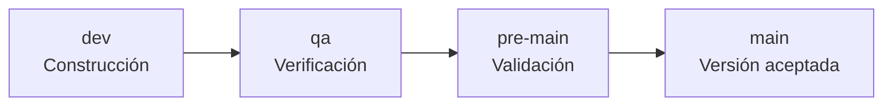

# Paso 1 - Plan de pruebas del sistema

Esta carpeta concentra exclusivamente el diseño de calidad y pruebas de **CleanIt**. Su organización sigue la plantilla académica de casos de prueba suministrada y los contenidos de la Unidad 3 sobre modelos de calidad, métricas, métodos de prueba y elaboración del plan.

> [!IMPORTANT]
> CleanIt dispone de un MVP ejecutable. Los resultados históricos de `evidencias-simuladas/` permanecen rotulados como simulación académica y los resultados de la versión candidata se registran separadamente en [`evidencias-reales/`](evidencias-reales/README.md).

## Contenido

| Orden | Documento | Propósito |
|---:|---|---|
| 1 | [Definiciones y fundamentos](01_Definiciones_y_fundamentos.md) | Unificar conceptos de calidad, verificación, validación, niveles y métricas |
| 2 | [Plan de pruebas de CleanIt](02_Plan_de_pruebas_CleanIt.md) | Definir alcance, recursos, ambiente, criterios, riesgos y gestión de defectos |
| 3 | [Estrategia de pruebas](03_Estrategia_de_pruebas.md) | Establecer niveles, técnicas, automatización prevista y puertas de calidad |
| 4 | [Modelo de casos de prueba](04_Modelo_de_casos_de_prueba.md) | Documentar 30 casos funcionales, no funcionales, unitarios, de integración y documentales |
| 5 | [Matriz de trazabilidad](05_Matriz_de_trazabilidad.md) | Relacionar historias de Jira, riesgos, atributos de calidad y casos |
| 6 | [Métricas de calidad](06_Metricas_de_calidad.md) | Definir fórmulas, metas y reglas de interpretación |
| 7 | [Evidencias simuladas](evidencias-simuladas/README.md) | Mostrar cómo se registrarían ciclos, defectos, repruebas y salidas |
| 8 | [Plantillas](plantillas/README.md) | Estandarizar el diseño y la futura ejecución de cada caso |
| 9 | [Documento formal](documentos/Modelo_de_casos_de_prueba_CleanIt.docx) | Presentar el modelo de casos en Word, adaptado de la plantilla suministrada |
| 10 | [Evidencias reales](evidencias-reales/README.md) | Registrar la ejecución del MVP, cobertura, limitaciones y decisión de promoción |

## Flujo de calidad por ramas

- En `dev` se diseñan y automatizan pruebas unitarias junto con el cambio.
- En `qa` se ejecutan pruebas de integración y del sistema, y se registran defectos.
- En `pre-main` se realiza regresión, seguridad, rendimiento y aceptación.
- En `main` solo se conserva una versión que haya superado los criterios de salida.

## Convenciones de estado

| Estado | Significado |
|---|---|
| Diseñado | El caso tiene objetivo, condiciones, datos, procedimiento y resultado esperado |
| No ejecutado | Todavía no existe una ejecución real asociada |
| Aprobado | El resultado observado coincide con el esperado |
| Fallido | Existe una diferencia reproducible frente al resultado esperado |
| Bloqueado | Una condición externa impide completar el procedimiento |
| No aplica | El caso no corresponde al alcance de la versión, con justificación registrada |

Un resultado solo podrá marcarse como **Aprobado**, **Fallido** o **Bloqueado** después de indicar versión o commit, ambiente, fecha, ejecutor y evidencia verificable.
