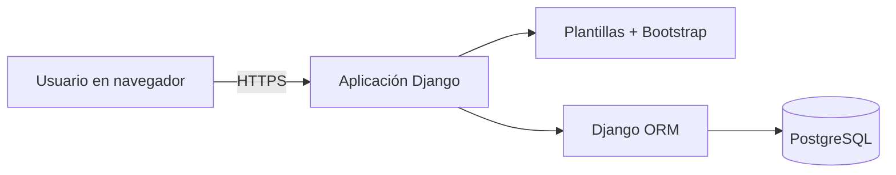

# CleanIt - Organizador de tareas de limpieza

CleanIt es la propuesta de una aplicación web para organizar, asignar y supervisar tareas de limpieza en una casa compartida, residencia estudiantil o pequeño local. El sistema busca reemplazar acuerdos verbales y mensajes dispersos por responsabilidades visibles, frecuencias definidas y un historial verificable.

> [!IMPORTANT]
> **Estado del proyecto:** planificación y documentación académica. A la fecha de esta entrega no existe una versión funcional ni desplegada. Los resultados incluidos en `docs/evidencias/` son simulaciones académicas, no salidas obtenidas de una aplicación ejecutable.

## Objetivo

Desarrollar un sistema web que permita organizar, asignar y supervisar las tareas de limpieza mediante la definición de responsables y frecuencias, el registro de actividades completadas y la consulta de tareas pendientes.

## Alcance del producto mínimo viable

- Registrar personas participantes.
- Editar o desactivar usuarios.
- Crear, consultar, editar y retirar tareas de limpieza.
- Asociar las tareas con una zona del espacio.
- Asignar cada tarea a una persona activa.
- Configurar una frecuencia única, diaria, semanal o mensual.
- Consultar tareas pendientes y vencidas.
- Marcar una actividad como completada.
- Conservar el responsable y la fecha de cumplimiento.
- Consultar el estado y el historial de las tareas.

Quedan fuera de la primera versión los pagos, la contratación de personal, el inventario de productos, los sensores inteligentes, las múltiples sedes y una aplicación móvil nativa.

## Entregable final

| Requisito de la actividad | Documento principal | Material complementario |
|---|---|---|
| Plan de pruebas | [Plan de pruebas](docs/01_PLAN_DE_PRUEBAS.md) | [Casos detallados](docs/02_CASOS_DE_PRUEBA.md) y [matriz de trazabilidad](docs/07_MATRIZ_DE_TRAZABILIDAD.md) |
| Evidencias simuladas | [Resultados simulados](docs/03_RESULTADOS_SIMULADOS.md) | [Evidencias por ciclo](docs/evidencias/README.md) |
| Manual básico | [Manual de usuario](docs/04_MANUAL_DE_USUARIO.md) | Procedimientos para administrador y participante |
| Documentación técnica | [Documentación técnica](docs/05_DOCUMENTACION_TECNICA.md) | [Arquitectura](docs/diagramas/arquitectura.mmd) y [modelo de datos](docs/diagramas/modelo_datos.dbml) |
| Gestión postproyecto | [Estrategia postproyecto](docs/06_GESTION_POST_PROYECTO.md) | Plantillas de incidencias y cambios en `.github/` |

Los documentos de la actividad anterior y el cronograma están conservados en [`docs/antecedentes/`](docs/antecedentes/README.md).

## Tecnologías propuestas

- **Interfaz:** plantillas de Django, HTML, CSS y Bootstrap.
- **Lógica del servidor:** Python y Django.
- **Persistencia:** PostgreSQL mediante Django ORM.
- **Ambiente reproducible:** Docker Compose.
- **Gestión:** Jira con metodología Scrum.
- **Versionamiento y documentación:** Git y GitHub.

La selección busca reducir la complejidad de un producto CRUD pequeño. Django integra autenticación, permisos, formularios, validaciones, ORM, migraciones y herramientas de pruebas dentro del mismo framework.

## Arquitectura propuesta



La aplicación seguirá una arquitectura monolítica modular. El navegador no accederá directamente a PostgreSQL; toda operación pasará por Django y sus controles de autenticación, autorización y validación.

## Organización prevista del código

```text
cleanit/
|-- config/                  # Configuración general de Django
|-- apps/
|   |-- accounts/            # Usuarios, roles y autenticación
|   |-- chores/              # Tareas, zonas y frecuencias
|   `-- tracking/            # Pendientes e historial
|-- templates/               # Interfaz renderizada por Django
|-- static/                  # CSS, JavaScript e imágenes
`-- tests/                   # Pruebas automatizadas
```

La carpeta `src/` de esta entrega contiene solo una nota de planificación. La estructura anterior se implementará cuando el desarrollo sea autorizado e iniciado.

## Gestión del trabajo

- **Jira:** <https://sergiomarin2001.atlassian.net> (puede requerir invitación).
- **Repositorio:** <https://github.com/WreckerSg/CleanIt>.
- **Épicas:** Gestión de usuarios, Gestión de tareas de limpieza, Seguimiento y cumplimiento.
- **Flujo:** To Do, In Progress, In Review y Done.
- **Sprints:** cuatro iteraciones de dos semanas.

## Cómo revisar esta entrega

1. Leer este archivo y el [estado del proyecto](docs/00_ESTADO_DEL_PROYECTO.md).
2. Revisar la estrategia y los [casos de prueba](docs/02_CASOS_DE_PRUEBA.md).
3. Comprobar que los [resultados](docs/03_RESULTADOS_SIMULADOS.md) están identificados como simulados.
4. Consultar el [manual de usuario](docs/04_MANUAL_DE_USUARIO.md).
5. Revisar la [documentación técnica](docs/05_DOCUMENTACION_TECNICA.md).
6. Evaluar la [estrategia de soporte y mantenimiento](docs/06_GESTION_POST_PROYECTO.md).
7. Completar el [checklist antes de presentar la URL](docs/08_CHECKLIST_DE_ENTREGA.md).

Si el repositorio todavía está vacío, siga la [guía para subir el paquete a GitHub](docs/11_GUIA_PARA_SUBIR_A_GITHUB.md).

## Autoría y contexto académico

- **Autor:** Sergio Andres Marin Martinez
- **Curso:** Ingeniería de Software
- **Docente:** Clara Lucía Monsalve Rios
- **Institución:** Fundación Universitaria Católica del Norte
- **Año:** 2026
