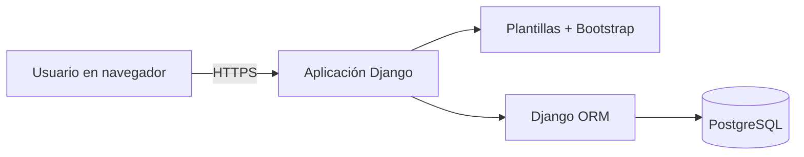
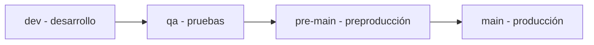

# CleanIt - Organizador de tareas de limpieza

CleanIt es una aplicación web en desarrollo para organizar, asignar y supervisar tareas de limpieza en una casa compartida, residencia estudiantil o pequeño local. El sistema busca reemplazar acuerdos verbales y mensajes dispersos por responsabilidades visibles, frecuencias definidas y un historial verificable.

> [!IMPORTANT]
> **Estado del proyecto:** el Paso 1 fue aceptado en `main`. El incremento 2.2 está en `dev` e incluye autenticación, roles, administración de cuentas, zonas y tareas, respaldado por 18 pruebas automatizadas. Todavía no existe un despliegue público. Los resultados históricos de [`Plan de pruebas/evidencias-simuladas/`](Plan%20de%20pruebas/evidencias-simuladas/README.md) continúan identificados como simulaciones académicas.

## Objetivo

Desarrollar un sistema web que permita organizar, asignar y supervisar las tareas de limpieza mediante la definición de responsables y frecuencias, el registro de actividades completadas y la consulta de tareas pendientes.

## Alcance del producto mínimo viable

- Registrar personas participantes.
- Editar o desactivar usuarios.
- Crear, consultar, editar y retirar tareas de limpieza.
- Asociar las tareas con una zona del espacio.
- Asignar cada tarea a una persona activa.
- Configurar una frecuencia única, diaria, semanal o mensual.
- Consultar tareas pendientes y vencidas.
- Marcar una actividad como completada.
- Conservar el responsable y la fecha de cumplimiento.
- Consultar el estado y el historial de las tareas.

Quedan fuera de la primera versión los pagos, la contratación de personal, el inventario de productos, los sensores inteligentes, las múltiples sedes y una aplicación móvil nativa.

## Entregable final

| Requisito de la actividad | Documento principal | Material complementario |
|---|---|---|
| Plan de pruebas | [Carpeta del Paso 1](Plan%20de%20pruebas/README.md) | Definiciones, estrategia, 30 casos detallados, métricas, trazabilidad y plantillas |
| Evidencias simuladas | [Resultados simulados](Plan%20de%20pruebas/evidencias-simuladas/README.md) | Dos ciclos hipotéticos, defectos y salida de ejemplo |
| Manual básico | [Manual de usuario](Documentaci%C3%B3n%20t%C3%A9cnica%20y%20de%20usuario/01_Manual_basico_de_usuario.md) | Procedimientos comprobados para administrador y participante |
| Documentación técnica | [Descripción y justificación técnica](Documentaci%C3%B3n%20t%C3%A9cnica%20y%20de%20usuario/02_Descripcion_y_justificacion_tecnica.md) | [Guía de instalación](Documentaci%C3%B3n%20t%C3%A9cnica%20y%20de%20usuario/03_Guia_de_instalacion_y_ejecucion.md) y diagramas |
| Gestión postproyecto | [Estrategia postproyecto](docs/06_GESTION_POST_PROYECTO.md) | Plantillas de incidencias y cambios en `.github/` |

Los documentos de la actividad anterior y el cronograma están conservados en [`docs/antecedentes/`](docs/antecedentes/README.md).

## Tecnologías utilizadas

- **Interfaz:** plantillas de Django, HTML y CSS; Bootstrap se incorporará con los formularios del producto.
- **Lógica del servidor:** Python y Django.
- **Persistencia:** PostgreSQL mediante Django ORM.
- **Ambiente reproducible:** Docker Compose.
- **Gestión:** Jira con metodología Scrum.
- **Versionamiento y documentación:** Git y GitHub.

La selección busca reducir la complejidad de un producto CRUD pequeño. Django integra autenticación, permisos, formularios, validaciones, ORM, migraciones y herramientas de pruebas dentro del mismo framework.

## Arquitectura implementada



La aplicación seguirá una arquitectura monolítica modular. El navegador no accederá directamente a PostgreSQL; toda operación pasará por Django y sus controles de autenticación, autorización y validación.

## Organización del código

```text
src/
|-- config/                  # Configuración general de Django
|-- apps/
|   |-- accounts/            # Usuarios, roles y autenticación
|   |-- chores/              # Zonas, tareas, responsables y frecuencias
|   `-- core/                # Panel inicial por rol
|-- templates/               # Interfaz renderizada por Django
`-- static/                  # CSS e imágenes
```

Los módulos de tareas y seguimiento se añadirán en los siguientes incrementos sin separar el producto en servicios innecesarios.

## Gestión del trabajo

- **Jira:** enlace privado compartido mediante el espacio de entrega académica.
- **Repositorio:** <https://github.com/WreckerSg/CleanIt>.
- **Épicas:** Gestión de usuarios, Gestión de tareas de limpieza, Seguimiento y cumplimiento.
- **Flujo:** To Do, In Progress, In Review y Done.
- **Sprints:** cuatro iteraciones de dos semanas.

## Flujo de ramas

El repositorio utiliza cuatro ramas permanentes. Los cambios avanzan en un solo sentido y mediante pull request:



| Rama | Propósito | Condición para recibir cambios |
|---|---|---|
| `dev` | Integrar desarrollo y documentación en curso | Revisión básica y relación con Jira |
| `qa` | Ejecutar pruebas unitarias, de integración y del sistema | Alcance identificable y casos asociados |
| `pre-main` | Regresión, seguridad, rendimiento y aceptación | Criterios de salida de QA satisfechos |
| `main` | Conservar únicamente versiones aceptadas | Aprobación final y ausencia de defectos críticos o altos |

Las reglas completas están en [CONTRIBUTING.md](CONTRIBUTING.md).

## Cómo revisar esta entrega

1. Leer este archivo y el [estado del proyecto](docs/00_ESTADO_DEL_PROYECTO.md).
2. Revisar el índice del [Plan de pruebas](Plan%20de%20pruebas/README.md).
3. Comprobar que los [resultados](Plan%20de%20pruebas/evidencias-simuladas/README.md) están identificados como simulados.
4. Consultar la carpeta de [Documentación técnica y de usuario](Documentaci%C3%B3n%20t%C3%A9cnica%20y%20de%20usuario/README.md).
5. Seguir la [guía de instalación y ejecución](Documentaci%C3%B3n%20t%C3%A9cnica%20y%20de%20usuario/03_Guia_de_instalacion_y_ejecucion.md).
6. Evaluar la [estrategia de soporte y mantenimiento](docs/06_GESTION_POST_PROYECTO.md).
7. Completar el [checklist antes de presentar la URL](docs/08_CHECKLIST_DE_ENTREGA.md).

Si el repositorio todavía está vacío, siga la [guía para subir el paquete a GitHub](docs/11_GUIA_PARA_SUBIR_A_GITHUB.md).

## Autoría y contexto académico

- **Autor:** Estudiante responsable del proyecto
- **Curso:** Ingeniería de Software
- **Docente:** Docente del curso
- **Institución:** Institución universitaria
- **Año:** 2026
