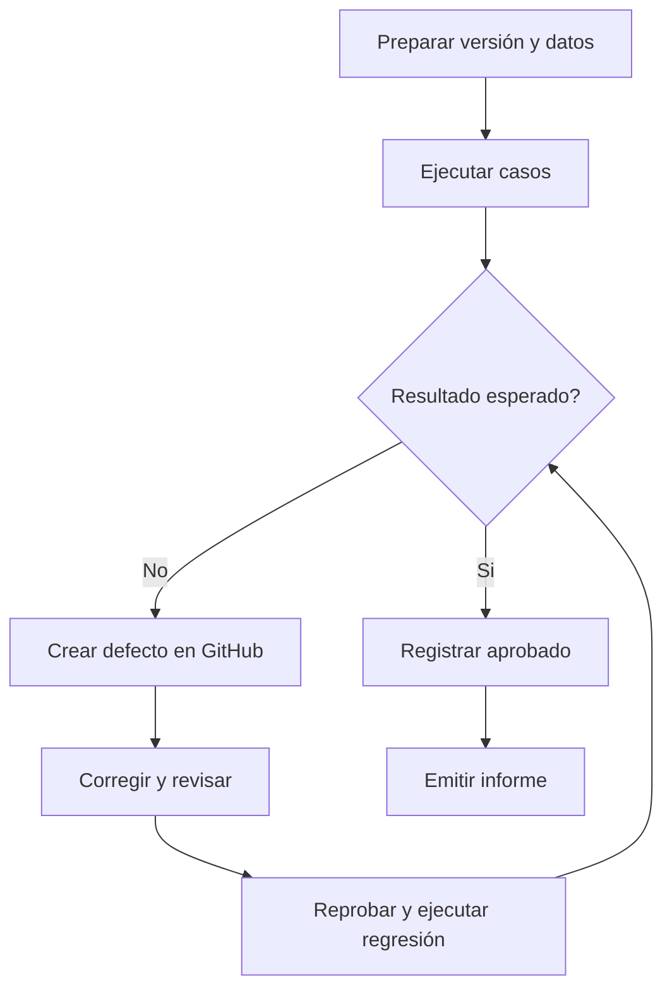

# Plan de pruebas del sistema CleanIt

## 1. Control del documento

| Campo | Valor |
|---|---|
| Proyecto | CleanIt - Organizador de tareas de limpieza |
| Versión del plan | 1.0 |
| Estado | Diseñado, pendiente de ejecución real |
| Fase del producto | Planificación |
| Responsable previsto | Calidad y DevOps |
| Fecha de referencia | 7 de septiembre de 2026 |

> [!CAUTION]
> Este plan fue elaborado antes de la implementación. Los archivos de resultados asociados son **simulaciones académicas** y muestran cómo se documentaría una futura ejecución.

## 2. Propósito

Definir el enfoque con el que se verificará que CleanIt satisface sus requisitos funcionales y no funcionales, protege la información de los usuarios y conserva la integridad de las asignaciones y del historial. El plan establece qué probar, cómo hacerlo, quiénes participarán, qué evidencia se conservará y bajo qué condiciones una versión podrá ser aceptada.

## 3. Objetivos de calidad

- Comprobar cada historia de usuario de SCRUM-15 a SCRUM-23 mediante al menos un escenario positivo y uno de validación o excepción.
- Verificar las reglas de frecuencia única, diaria, semanal y mensual.
- Evitar asignaciones a personas inactivas y accesos por fuera del rol autorizado.
- Confirmar que completar una tarea produce un solo registro de historial.
- Validar que los pendientes y vencimientos correspondan al usuario autenticado.
- Comprobar que la interfaz sea utilizable desde computador y teléfono.
- Evaluar tiempos de respuesta bajo la carga prevista para grupos pequeños.
- Verificar que el respaldo pueda restaurarse antes de autorizar un despliegue.

## 4. Alcance de las pruebas

### Incluido

- autenticación y cierre de sesión;
- administración básica de personas;
- creación, consulta, edición y retiro de tareas;
- zonas, responsables y estado activo;
- frecuencias y cálculo de la siguiente fecha;
- consulta de pendientes y tareas vencidas;
- registro de cumplimiento e historial;
- permisos de administrador y participante;
- validaciones de formularios y protección de datos;
- adaptabilidad básica de la interfaz;
- respaldo y restauración de PostgreSQL;
- carga representativa del contexto de uso.

### No incluido en la primera versión

- pagos, contratación o inventario de insumos;
- múltiples sedes o grupos aislados en una misma instancia;
- sensores o dispositivos inteligentes;
- aplicaciones moviles nativas;
- notificaciones por correo, SMS o mensajería;
- pruebas de infraestructura de alta disponibilidad;
- pruebas sobre integraciones externas no definidas.

## 5. Base de prueba

La cobertura se deriva de:

- objetivo y alcance aprobados en la actividad anterior;
- historias de usuario SCRUM-15 a SCRUM-23;
- tareas técnicas SCRUM-33 a SCRUM-36;
- riesgos identificados: baja adopción, frecuencia incorrecta, acceso no autorizado, pérdida de datos y falta de actualización;
- criterios de aceptación registrados en Jira;
- arquitectura propuesta con Django, Bootstrap y PostgreSQL.

La relación entre requisitos y casos puede consultarse en la [matriz de trazabilidad](07_MATRIZ_DE_TRAZABILIDAD.md).

## 6. Estrategia de pruebas

| Nivel o tipo | Objetivo | Técnica prevista | Momento |
|---|---|---|---|
| Unitaria | Verificar reglas aisladas de modelos y servicios | Pruebas integradas de Django, particiones de equivalencia y valores límite | Durante el desarrollo |
| Integración | Confirmar la colaboración entre formulario, vista, ORM y PostgreSQL | Pruebas con cliente de Django y base de datos temporal | Antes de integrar cada historia |
| Funcional del sistema | Validar flujos completos por rol | Casos manuales basados en historias y decisiones | Al cerrar los sprints 2 y 3 |
| Regresión | Detectar efectos secundarios de una corrección | Reejecución automatizada y selección de flujos críticos | En cada pull request y antes de liberar |
| Usabilidad | Comprobar comprension y facilidad de uso | Tareas moderadas con usuarios representativos | Sprint 4 |
| Rendimiento y estrés | Identificar degradación bajo carga superior a la esperada | Carga gradual sobre consultas y escrituras principales | Antes del despliegue |
| Seguridad | Revisar autenticación, autorización, CSRF, sesiones y entradas | Casos negativos y lista de controles de Django | Durante la integración y Sprint 4 |
| Aceptación | Confirmar valor y cumplimiento del alcance | Recorrido guiado con Product Owner | Cierre del Sprint 4 |
| Respaldo y recuperación | Verificar que la información pueda recuperarse | Exportación, restauración y comparación de conteos | Antes de cada liberación |

## 7. Técnicas de diseño

- **Particiones de equivalencia:** datos válidos e inválidos para nombres, correos, estados y frecuencias.
- **Valores límite:** campos vacios, longitudes maximas, fechas de fin de mes y cambio de año.
- **Tablas de decisión:** combinaciones de rol, estado del usuario y operación solicitada.
- **Transición de estados:** pendiente, vencida, completada, retirada e inactiva.
- **Pruebas basadas en riesgos:** prioridad alta para permisos, historial, frecuencias y respaldos.
- **Recorridos de usuario:** completar las tareas más frecuentes con la menor cantidad razonable de pasos.

## 8. Ambiente previsto

| Componente | Configuración propuesta |
|---|---|
| Aplicación | Django en modo de pruebas, configuración separada de producción |
| Base de datos | PostgreSQL exclusiva para pruebas |
| Navegadores | Versiones estables de Chrome, Firefox y Edge |
| Vista móvil | Anchos de 360 px, 390 px y 430 px mediante emulación y dispositivo real cuando sea posible |
| Contenedores | Docker Compose con servicios `web` y `db` |
| Datos | Usuarios y tareas ficticios, sin información personal real |
| Integración continua | Ejecución automática futura en cada pull request |

No se utilizarán bases de datos de producción para ejecutar pruebas destructivas.

## 9. Datos de prueba

| Identificador | Rol/estado | Uso |
|---|---|---|
| `admin.cleanit` | Administrador activo | Gestión de personas, tareas, asignaciones e historial |
| `ana.prueba` | Participante activo | Consulta y finalización de tareas propias |
| `luis.prueba` | Participante activo | Validación de aislamiento entre usuarios |
| `maria.inactiva` | Participante inactivo | Escenarios de rechazo de asignación y acceso |

Tareas representativas:

- `Barrer sala`, única, fecha actual;
- `Sacar basura`, diaria;
- `Limpiar baño`, semanal;
- `Lavar ventanas`, mensual con fecha ancla en el día 31;
- `Trapear cocina`, vencida.

## 10. Criterios de entrada

Una versión podrá iniciar pruebas formales cuando:

- el alcance de la versión esté definido;
- las historias incluidas tengan criterios de aceptación;
- las migraciones se apliquen sin errores;
- exista un ambiente separado con datos controlados;
- las pruebas unitarias existentes finalicen satisfactoriamente;
- no haya defectos críticos conocidos que impidan la ejecución;
- se haya identificado la versión o commit evaluado.

## 11. Criterios de salida y aceptación

La versión candidata podrá recomendarse para entrega cuando:

- se haya ejecutado el 100 % de los casos críticos y altos;
- todas las historias incluidas tengan cobertura;
- al menos el 95 % de los casos aplicables finalice satisfactoriamente;
- no existan defectos críticos ni altos abiertos;
- los defectos medios aceptados tengan tratamiento y fecha;
- la prueba de restauración termine correctamente;
- los flujos principales respondan en 2 segundos o menos en el percentil 95 bajo la carga objetivo;
- el Product Owner registre su aceptación o las observaciones pendientes.

El cumplimiento de estos umbrales solo podrá afirmarse después de una ejecución real.

## 12. Clasificación de defectos

| Severidad | Definición | Ejemplo |
|---|---|---|
| Crítica | Impide usar el sistema o compromete información sensible sin alternativa | Acceso total sin autenticación o pérdida del historial |
| Alta | Bloquea una función esencial o vulnera el aislamiento entre usuarios | Un participante modifica tareas administrativas |
| Media | Afecta una función, pero existe alternativa temporal | Cálculo incorrecto en una fecha mensual específica |
| Baja | Defecto visual o mejora que no impide completar el flujo | Texto desalineado en una resolución poco común |

La prioridad de corrección también considerará frecuencia, alcance e impacto para el usuario.

## 13. Ciclo de ejecución

Cada evidencia deberá registrar como mínimo: caso, fecha, ambiente, versión, ejecutor, datos utilizados, resultado esperado, resultado observado, estado y enlace al defecto cuando aplique.

## 14. Roles y responsabilidades

| Rol | Responsabilidad en calidad |
|---|---|
| Product Owner | Aclara criterios y decide la aceptación funcional |
| Scrum Master | Facilita el seguimiento de bloqueos y acciones |
| Desarrollo | Implementa pruebas unitarias, corrige defectos y participa en revisión de código |
| Calidad y DevOps | Mantiene casos, prepara ambientes, ejecuta pruebas y consolida evidencia |
| Usuario representativo | Participa en las pruebas de usabilidad y aceptación |

Una persona puede asumir varios roles en un equipo pequeño, pero no debe aprobar sin revisión sus propios cambios de seguridad o persistencia cuando exista otra persona disponible.

## 15. Métricas

- porcentaje de requisitos con casos asociados;
- porcentaje de casos ejecutados, aprobados, fallidos y bloqueados;
- defectos por severidad y componente;
- porcentaje de defectos reabiertos;
- tiempo medio de corrección;
- tiempo de respuesta p50, p95 y p99;
- tasa de errores bajo carga;
- tasa de éxito de tareas de usabilidad;
- restauraciones correctas sobre intentos realizados.

## 16. Riesgos del proceso de prueba

| Riesgo | Impacto | Tratamiento |
|---|---|---|
| No contar con software ejecutable | No es posible producir evidencia real | Mantener resultados rotulados como simulados y ejecutar al existir un MVP |
| Criterios ambiguos | Resultados inconsistentes | Revisar cada criterio con Product Owner antes de probar |
| Datos insuficientes | No se cubren límites ni excepciones | Mantener un catálogo versionado de datos ficticios |
| Ambiente diferente a producción | Defectos no detectados | Igualar versiones y configuración mediante contenedores |
| Poco tiempo para regresión | Efectos secundarios | Automatizar primero los flujos críticos |
| Evidencia con datos personales | Riesgo de privacidad | Usar identidades ficticias y revisar capturas antes de publicarlas |

## 17. Entregables de pruebas

- [Casos de prueba detallados](02_CASOS_DE_PRUEBA.md).
- [Resultados simulados](03_RESULTADOS_SIMULADOS.md).
- [Matriz de trazabilidad](07_MATRIZ_DE_TRAZABILIDAD.md).
- [Evidencias simuladas por ciclo](evidencias/README.md).
- Incidencias registradas mediante la plantilla de GitHub.
- Informe real de ejecución, pendiente hasta disponer de una versión funcional.
