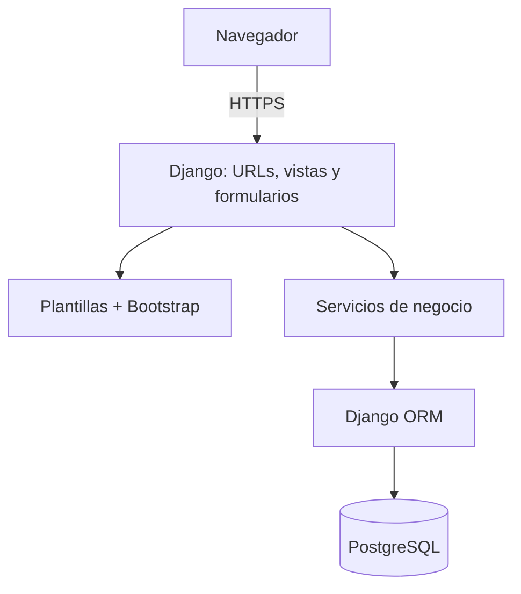
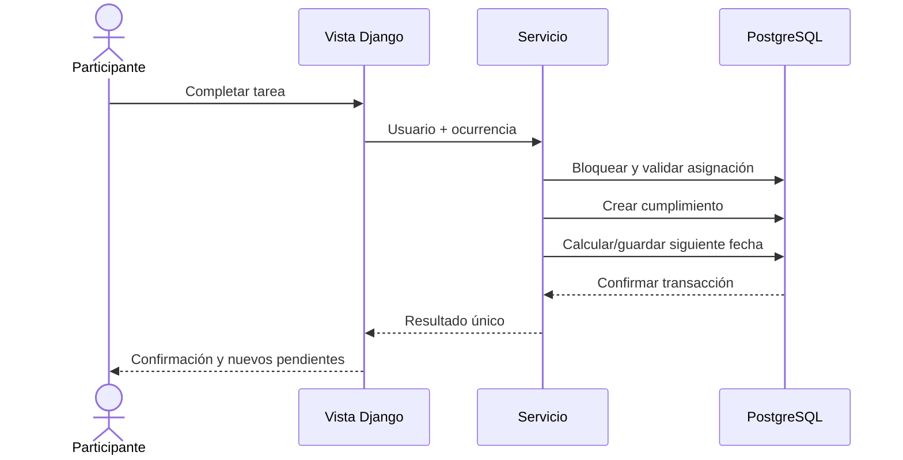

# Documentación técnica de CleanIt

## 1. Estado y objetivo

Este documento específica la solución propuesta para la futura implementación de CleanIt. No describe una aplicación ya construida. Su objetivo es orientar el desarrollo, las pruebas, el despliegue y el mantenimiento sin ampliar el alcance aprobado.

## 2. Decisiones principales

| Área | Selección propuesta | Justificación |
|---|---|---|
| Arquitectura | Monolito modular renderizado en servidor | Reduce componentes de despliegue y mantiene separación lógica |
| Backend | Python y Django | Integra autenticación, permisos, formularios, ORM, migraciones y pruebas |
| Frontend | Plantillas de Django, HTML, CSS y Bootstrap | Evita un frontend separado y facilita una interfaz adaptable |
| Datos | PostgreSQL | Mantiene relaciones, restricciones, transacciones e integridad |
| Acceso a datos | Django ORM | Versiona modelos y migraciones y reduce SQL repetitivo |
| Ambiente | Docker Compose | Permite reproducir los servicios web y de base de datos |
| Gestión | Jira y Scrum | Conserva backlog, sprints, responsables y criterios |
| Versionamiento | Git y GitHub | Mantiene historial, revisión y trazabilidad con Jira |

## 3. Arquitectura lógica



Responsabilidades:

- **Presentación:** plantillas, formularios y componentes responsivos.
- **Aplicación:** vistas, autorización, coordinación de casos de uso y mensajes.
- **Dominio:** reglas de asignación, recurrencia, estados y finalización.
- **Persistencia:** modelos, restricciones, transacciones y consultas mediante ORM.

El archivo fuente del diagrama se encuentra en [`diagramas/arquitectura.mmd`](diagramas/arquitectura.mmd).

## 4. Módulos propuestos

| Módulo Django | Responsabilidad |
|---|---|
| `accounts` | Usuarios, roles, estado activo, acceso y permisos |
| `chores` | Zonas, tareas, frecuencias y asignaciones |
| `tracking` | Pendientes, vencimientos, finalizaciones e historial |
| `core` | Página inicial, utilidades compartidas, manejo de errores y auditoría técnica mínima |

La división en módulos no implica servicios separados. Todos formarán parte de una sola aplicación desplegable para el MVP.

## 5. Modelo de datos propuesto

Entidades centrales:

- **User:** identidad, credenciales gestionadas por Django, rol y estado.
- **Zone:** lugar donde se realiza una tarea.
- **Chore:** definición de la actividad, frecuencia y próxima fecha.
- **Assignment:** relación vigente o histórica entre tarea y responsable.
- **Completion:** evidencia de una ocurrencia completada.

Reglas de integridad:

- usuario y correo no se duplican según la política definida;
- una asignación nueva solo acepta una persona activa;
- una tarea retirada no produce ocurrencias futuras;
- una ocurrencia solo puede tener un cumplimiento;
- retirar una tarea o desactivar una persona no elimina el historial;
- las fechas se almacenan de forma coherente con la zona horaria configurada;
- las operaciones de finalizar y programar la siguiente ocurrencia ocurren dentro de una transacción.

El modelo detallado y versionable está en [`diagramas/modelo_datos.dbml`](diagramas/modelo_datos.dbml).

## 6. Reglas de frecuencia

| Tipo | Regla |
|---|---|
| `ONCE` | Completar cierra la tarea y deja `next_due_date` sin valor |
| `DAILY` | Suma un día a la fecha programada |
| `WEEKLY` | Suma siete días a la fecha programada |
| `MONTHLY` | Avanza un mes conservando `recurrence_anchor_day`; si no existe, usa el último día válido |

La siguiente fecha se calcula desde la ocurrencia programada y no desde el momento exacto en que la persona la completa. Esto evita desplazar permanentemente el calendario cuando una tarea se registra con retraso. Una decisión distinta deberá aprobarse como cambio de requisito.

## 7. Flujo de finalización



La validación del rol y del responsable se realiza en el servidor. Deshabilitar el botón después de enviarlo mejora la experiencia, pero no reemplaza la protección contra solicitudes duplicadas.

## 8. Autenticación y autorización

- Utilizar el sistema de autenticación y hash de contraseñas de Django.
- Exigir sesión para todas las páginas privadas.
- Implementar grupos o permisos equivalentes para `Administrador` y `Participante`.
- Verificar permisos en las vistas y consultas; ocultar menús no es un control suficiente.
- Limitar los querysets para que una persona consulte solo sus asignaciones.
- Rechazar cuentas inactivas.
- Aplicar protección CSRF en formularios y cambios de estado.
- No registrar contraseñas, claves secretas ni tokens en logs.

Django incluye controles para varias amenazas web, pero la configuración de producción debe revisarse expresamente; el framework no sustituye el análisis del sistema.

## 9. Estructura futura del repositorio

```text
CleanIt/
|-- .github/
|-- docs/
|-- src/
|   |-- manage.py
|   |-- config/
|   |-- apps/
|   |   |-- accounts/
|   |   |-- chores/
|   |   |-- tracking/
|   |   `-- core/
|   |-- templates/
|   `-- static/
|-- tests/
|-- compose.yaml
|-- Dockerfile
|-- requirements.txt
|-- .env.example
`-- README.md
```

La estructura actual contiene documentación y reservas de carpeta, no los componentes ejecutables mostrados.

## 10. Configuración

Las variables previstas se documentan en `.env.example`. En desarrollo podrán cargarse desde un archivo `.env` excluido de Git. En producción se deberá utilizar el mecanismo de secretos del proveedor o de Docker, según la plataforma.

Variables minimas:

- `DJANGO_SECRET_KEY`;
- `DJANGO_DEBUG`;
- `DJANGO_ALLOWED_HOSTS`;
- `DATABASE_NAME`;
- `DATABASE_USER`;
- `DATABASE_PASSWORD`;
- `DATABASE_HOST`;
- `DATABASE_PORT`;
- `TIME_ZONE`.

## 11. Procedimiento futuro de desarrollo

Una vez exista código:

1. copiar `.env.example` a `.env` y reemplazar valores locales;
2. construir e iniciar los servicios con Docker Compose;
3. aplicar migraciones;
4. crear una cuenta administradora de desarrollo;
5. ejecutar verificaciones y pruebas;
6. cargar solo datos ficticios en ambientes compartidos;
7. abrir la aplicación mediante el puerto documentado en `compose.yaml`.

Los comandos exactos se incorporarán cuando existan `Dockerfile`, `compose.yaml` y dependencias versionadas. Publicar comandos antes de definir esos archivos podría crear instrucciones falsas.

## 12. Estrategia de pruebas técnicas

La futura suite automatizada verificará:

- modelos y restricciones;
- formularios y valores inválidos;
- cálculo de frecuencias, incluidos fin de mes y año bisiesto;
- vistas y redirecciones por rol;
- aislamiento de querysets;
- finalización transaccional e idempotente;
- consultas de pendientes e historial;
- migraciones y comprobaciones de despliegue.

Comandos previstos de Django, sujetos a la estructura final:

```bash
python manage.py check
python manage.py test
python manage.py makemigrations --check --dry-run
python manage.py migrate --check
python manage.py check --deploy
```

`check --deploy` ayuda a detectar configuraciones riesgosas, pero debe ejecutarse con los ajustes de producción y complementarse con revisión manual.

## 13. Despliegue propuesto

Componentes minimos:

- servicio web Django servido mediante WSGI o ASGI adecuado para producción;
- proxy o plataforma que termine HTTPS;
- PostgreSQL con acceso restringido al servicio web;
- almacenamiento definido para archivos estáticos;
- gestión externa de secretos;
- registros de aplicación y alertas;
- tarea programada de respaldo.

Antes de desplegar:

- desactivar `DEBUG`;
- definir `ALLOWED_HOSTS`;
- proteger `SECRET_KEY` y credenciales;
- aplicar migraciones y recolectar archivos estáticos;
- ejecutar pruebas y `check --deploy`;
- confirmar HTTPS, cookies seguras y política de origenes;
- crear y restaurar un respaldo de prueba;
- documentar la versión liberada y el plan de reversa.

## 14. Respaldo y recuperación

- Ejecutar respaldo automático diario de la base de datos.
- Conservar siete copias diarias y cuatro semanales como punto de partida.
- Guardar al menos una copia fuera del servicio principal.
- Cifrar respaldos que contengan datos personales.
- Restringir acceso y registrar restauraciones.
- Realizar una prueba mensual de recuperación en un ambiente aislado.
- Definir inicialmente un RPO de 24 horas y un RTO de 4 horas; validarlos cuando se conozca el uso real.

La existencia de un archivo de respaldo no demuestra que sea recuperable; CP-24 exige restaurarlo y comparar su integridad.

## 15. Observabilidad y operación

Registrar, sin datos sensibles:

- errores no controlados;
- inicios de sesión fallidos agregados para detectar abuso;
- tareas administrativas relevantes;
- duración y resultado de respaldos;
- estado del servicio y conexion con la base de datos;
- tiempos de respuesta de flujos críticos.

Las alertas iniciales cubrirán indisponibilidad, incremento de errores, respaldo fallido y poco espacio de almacenamiento.

## 16. Limitaciones y decisiones pendientes

- No se ha seleccionado proveedor de alojamiento.
- No existe versión mínima cerrada de Python, Django o PostgreSQL; se fijará al iniciar implementación y se versionará en los archivos del proyecto.
- No se han realizado pruebas de capacidad ni estimado consumo real.
- No se ha definido recuperación de contraseña por correo.
- No se han implementado notificaciones ni múltiples espacios.
- El modelo de datos es conceptual y deberá convertirse en migraciones revisadas.

## 17. Referencias oficiales

- [Documentación de Django](https://docs.djangoproject.com/en/6.1/).
- [Seguridad en Django](https://docs.djangoproject.com/en/6.1/topics/security/).
- [Lista de comprobación de despliegue de Django](https://docs.djangoproject.com/en/6.1/howto/deployment/checklist/).
- [Pruebas en Django](https://docs.djangoproject.com/en/6.1/topics/testing/).
- [Sistema de grilla adaptable de Bootstrap](https://getbootstrap.com/docs/5.3/layout/grid/).
- [Formularios de Bootstrap](https://getbootstrap.com/docs/5.3/forms/overview/).
- [Especificación de Docker Compose](https://docs.docker.com/reference/compose-file/).
- [Gestión de secretos en Docker Compose](https://docs.docker.com/compose/how-tos/use-secrets/).
- [Documentación vigente de PostgreSQL](https://www.postgresql.org/docs/current/).
- [`pg_dump` en PostgreSQL](https://www.postgresql.org/docs/current/app-pgdump.html).
