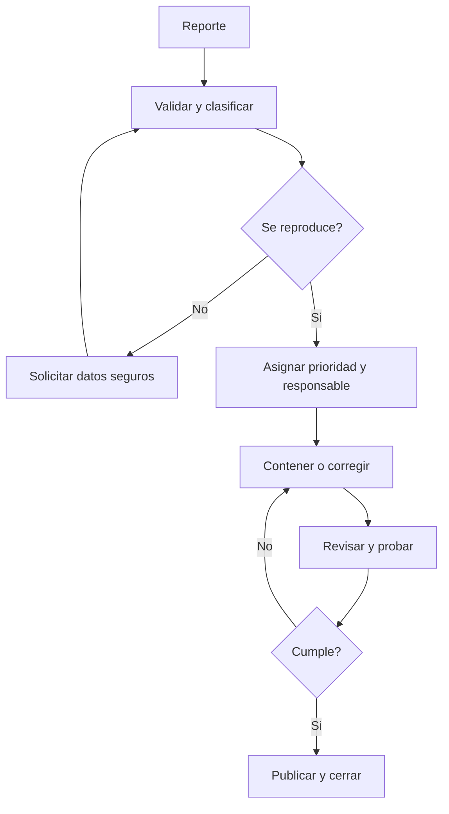

# Estrategia de gestión postproyecto

## 1. Propósito

Definir cómo se realizará el seguimiento, soporte, mantenimiento y evolución de CleanIt después de entregar una primera versión funcional. La estrategia busca que los problemas tengan responsable, prioridad, evidencia y cierre verificable, y que el producto pueda mantenerse sin depender exclusivamente de quien lo desarrolló inicialmente.

> La carpeta vigente del Paso 3 se encuentra en [`Gestión post-proyecto/`](../Gestión%20post-proyecto/README.md). Este documento conserva el desarrollo ampliado de la estrategia y sus metas deben revisarse con datos reales antes de un despliegue público.

## 2. Objetivos operativos

- Mantener disponibles los flujos de consulta y finalización de tareas.
- Atender incidentes de acuerdo con su impacto y urgencia.
- Proteger la información personal y las credenciales.
- Verificar respaldos y capacidad de recuperación.
- Actualizar dependencias sin introducir regresiones.
- Conservar trazabilidad entre solicitud, cambio, prueba y versión.
- Recoger retroalimentación para priorizar mejoras con el Product Owner.

## 3. Modelo de soporte

| Nivel | Responsable propuesto | Alcance |
|---|---|---|
| Nivel 1 | Administrador funcional | Dudas de uso, cuentas inactivas, asignaciones y verificación inicial |
| Nivel 2 | Calidad/soporte técnico | Reproducción, clasificación, evidencia y alternativas temporales |
| Nivel 3 | Desarrollo/DevOps | Corrección de código, datos, seguridad, infraestructura y restauración |
| Decisión de producto | Product Owner | Prioridad de mejoras, aceptación de riesgos y cambios de alcance |

En un equipo pequeño una persona puede cubrir varios niveles, pero cada incidencia debe conservar un responsable visible.

## 4. Canales

- **Incidencias y defectos:** GitHub Issues mediante la plantilla `Reporte de error`.
- **Solicitudes de mejora:** GitHub Issues mediante `Solicitud de mejora`.
- **Planificación:** backlog de Jira con enlace a la incidencia correspondiente.
- **Comunicación urgente:** canal interno definido por el equipo; la decisión final se registra en GitHub o Jira.
- **Documentación:** archivos Markdown versionados en este repositorio.

No se deben publicar contraseñas, tokens, respaldos, datos personales ni evidencias sensibles en incidencias públicas.

## 5. Clasificación y objetivos de atención

| Prioridad | Criterio | Ejemplo | Confirmación inicial | Objetivo de solución o plan |
|---|---|---|---:|---:|
| P1 - Crítica | Servicio inutilizable, pérdida de datos o riesgo grave de seguridad | Nadie puede acceder o se exponen credenciales | 4 horas | 24 horas |
| P2 - Alta | Función esencial bloqueada para varios usuarios | No es posible completar tareas o se ven datos ajenos | 1 día hábil | 3 días hábiles |
| P3 - Media | Función degradada con alternativa temporal | Filtro incorrecto o recurrencia en un caso límite | 2 días hábiles | 10 días hábiles |
| P4 - Baja | Problema visual, documental o mejora | Etiqueta poco clara | 5 días hábiles | Próxima versión planificada |

Los tiempos son objetivos iniciales y se miden en horario hábil. Un incidente de seguridad puede requerir contención inmediata antes de determinar una corrección definitiva.

## 6. Flujo de una incidencia

Registro mínimo:

- identificador y fecha;
- versión o commit;
- ambiente y usuario afectado sin datos sensibles;
- pasos para reproducir;
- resultado esperado y observado;
- impacto, severidad y prioridad;
- responsable y decisiones;
- casos de prueba ejecutados;
- versión en la que se corrige;
- confirmación del cierre.

## 7. Gestión de cambios

1. Registrar la necesidad y el problema que intenta resolver.
2. Identificar stakeholders afectados y criterios de aceptación.
3. Evaluar valor, esfuerzo, riesgo, seguridad, datos y mantenimiento.
4. Decidir con el Product Owner si se rechaza, aplaza o incorpora al backlog.
5. Relacionar el elemento de Jira con la incidencia de GitHub.
6. Desarrollar en una rama independiente.
7. Abrir pull request con pruebas y plan de reversa cuando aplique.
8. Aprobar, integrar y documentar la versión.

Los cambios de alcance, por ejemplo múltiples sedes o notificaciones, no se incorporarán como correcciones menores.

## 8. Versionamiento y liberaciones

A partir de la primera implementación se propone versionamiento semántico:

- **MAJOR:** cambio incompatible o rediseño significativo.
- **MINOR:** nueva funcionalidad compatible.
- **PATCH:** corrección compatible.

Cada liberación debe incluir:

- etiqueta de Git;
- notas en `CHANGELOG.md`;
- historias y defectos incluidos;
- resultado de pruebas;
- migraciones requeridas;
- respaldo previo;
- procedimiento de despliegue y reversa;
- aprobación del responsable.

## 9. Plan de mantenimiento

| Frecuencia | Actividad |
|---|---|
| Continua | Revisar disponibilidad, errores y alertas críticas |
| Diaria | Confirmar resultado del respaldo automático |
| Semanal | Clasificar incidencias, revisar capacidad y errores repetidos |
| Mensual | Restaurar un respaldo en ambiente aislado; revisar dependencias y cuentas activas |
| Trimestral | Revisar permisos, riesgos, documentación, rendimiento y necesidades de usuarios |
| Por versión | Ejecutar regresión, actualizar manual, changelog y matriz de trazabilidad |

Las actualizaciones de seguridad críticas no deben esperar al ciclo mensual; se evaluarán tan pronto sean conocidas.

## 10. Monitoreo y alertas

Indicadores técnicos iniciales:

- disponibilidad del servicio;
- tiempo de respuesta p95 de acceso, pendientes, finalización e historial;
- tasa de respuestas 5xx;
- conexiones y uso de almacenamiento de PostgreSQL;
- resultado y antigüedad del último respaldo;
- errores de autenticación agregados;
- trabajos de mantenimiento fallidos.

Alertas prioritarias:

- servicio sin responder;
- errores 5xx por encima del umbral acordado;
- base de datos inaccesible;
- respaldo diario fallido o demasiado antiguo;
- almacenamiento próximo a agotarse;
- patrón anormal de intentos de acceso.

## 11. Respaldo y continuidad

Política inicial:

- respaldo diario con retención de siete copias diarias y cuatro semanales;
- copia fuera del servicio principal;
- cifrado y control de acceso;
- prueba mensual de restauración;
- registro de duración, tamaño, resultado y responsable;
- RPO objetivo de 24 horas;
- RTO objetivo de 4 horas.

Procedimiento de contingencia:

1. declarar el incidente y detener escrituras si existe riesgo de corrupción;
2. identificar la última copia válida;
3. restaurar en un ambiente aislado;
4. comprobar usuarios, tareas, asignaciones e historial;
5. autorizar el retorno del servicio;
6. registrar pérdida potencial y acciones preventivas.

Mientras el sistema no esté disponible, el grupo podrá registrar temporalmente las tareas en una lista compartida controlada. Al recuperarse el servicio, una persona autorizada conciliará los registros para evitar duplicados.

## 12. Seguridad y privacidad

- Revisar cuentas y permisos al menos cada trimestre.
- Desactivar oportunamente a quienes ya no pertenecen al grupo.
- Recolectar solo la información personal necesaria.
- Aplicar actualizaciones de seguridad y probar regresión.
- Conservar secretos fuera de Git y rotarlos ante sospecha de exposición.
- Revisar logs y capturas antes de compartirlos.
- Documentar incidentes conforme a `SECURITY.md`.
- Definir períodos de retención y eliminación antes de operar con usuarios reales.

## 13. Indicadores de gestión

| Indicador | Cálculo | Meta inicial propuesta |
|---|---|---:|
| Cumplimiento de respaldo | Respaldos correctos / respaldos programados | >= 98 % |
| Restauraciones verificadas | Restauraciones correctas / intentos | 100 % |
| Casos aprobados por versión | Casos aprobados / casos aplicables | >= 95 % |
| Defectos reabiertos | Defectos reabiertos / defectos cerrados | < 10 % |
| Atención dentro del objetivo | Casos atendidos a tiempo / casos totales | >= 90 % |
| Éxito de tareas de usabilidad | Flujos completados / flujos intentados | >= 85 % |
| Tareas vencidas en operación | Tareas vencidas / tareas programadas | Tendencia descendente |

Las metas se revisarán después de disponer de datos reales. No se utilizarán las cifras simuladas como línea base operativa.

## 14. Plan de los primeros 90 días posteriores al MVP

### Días 1 a 30 - Estabilización

- seguimiento diario de errores y respaldos;
- atención prioritaria a bloqueos de acceso y cumplimiento;
- encuesta breve de claridad;
- correcciones pequeñas sin ampliar alcance.

### Días 31 a 60 - Ajuste

- análisis de patrones de uso y tareas vencidas;
- automatización de regresión de los flujos más usados;
- revisión de rendimiento y consultas;
- actualización del manual según preguntas frecuentes.

### Días 61 a 90 - Evolución controlada

- retrospectiva con stakeholders;
- priorización de mejoras;
- revisión de riesgos, permisos y retención;
- decisión sobre una versión 1.1 o cierre de estabilización.

## 15. Transferencia y cierre

Antes de considerar transferido el producto se debe entregar:

- acceso autorizado al repositorio y al ambiente;
- inventario de componentes y dependencias;
- variables requeridas sin compartir secretos en el documento;
- procedimiento de despliegue y reversa;
- respaldo verificado y procedimiento de restauración;
- manual de usuario y documentación técnica actualizados;
- incidencias abiertas, riesgos aceptados y próximas acciones;
- responsables de producto, soporte y operación;
- acta de aceptación firmada o aprobada digitalmente.

La [plantilla de acta de aceptación](09_PLANTILLA_ACTA_DE_ACEPTACION.md) puede utilizarse al finalizar el Sprint 4.
